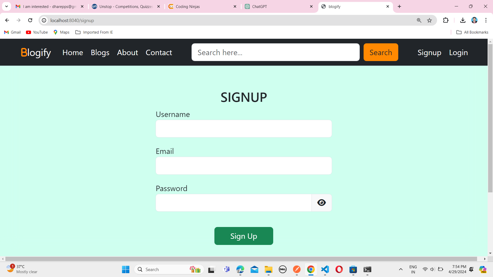
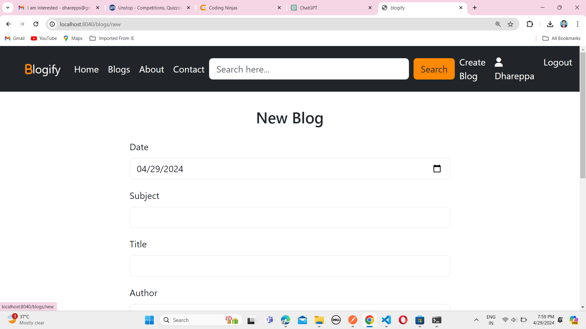
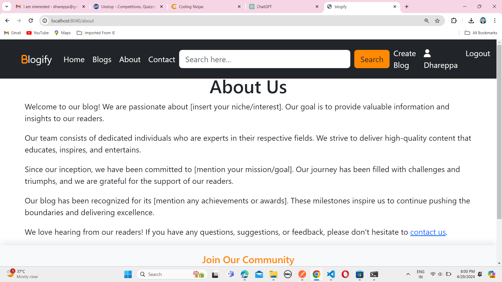

# Blogify

Blogify is a simple and intuitive blogging platform that provides you with a platform to share your thoughts, experiences, and knowledge. With Blogify, you can easily write new blog posts, read existing posts, and interact with your readers.
 

### Features

1. Create your Blog Posts: You can write new blog posts to share with your readers.  
2. Edit and Update: You can edit and update your existing blog posts as needed.  
3. Categories: Organize your blog posts into categories for easier navigation by readers.  
4. Comments: Readers can share their thoughts and feedback through comments, making your blog posts more engaging.  
5. User Authentication: Secure user authentication system allows users to sign up and sign in easily.  
6. Responsive Design: Blogify's design is responsive, allowing users to access it seamlessly on desktop, and mobile devices.  

### Installation

1. Clone the Repository: Clone the Blogify repository to your local machine using git clone.  
   <code>git clone https://github.com/DhareppaHalli310807.git</code>  
2. Install Dependencies: Navigate to the project directory and install the dependencies.  
   <code>cd blogify</code>  
   <code>npm install</code>  
3. Set Environment Variables:   Create a .env file in the root directory and add necessary environment variables.  
   <code>PORT=8040</code>  
   <code>MONGODB_URI=your_mongodb_connection_uri</code>  
   <code>SESSION_SECRET=your_session_secret</code>
4. Run the Application: Start the development server.  
   <code>npm start</code>  
5. Access Blogify: Open your web browser and visit <a>http://localhost:8040</a> to access the Blogify application.
    

### Technologies Used

1. Node.js: Backend development  
2. Express.js: Web application framework  
3. MongoDB: Database management  
4. Mongoose: MongoDB object modeling for Node.js  
5. Passport.js: User authentication middleware for Node.js  
6. Bootstrap: Frontend styling and design
    

### Contributing

Contributions are welcome! If you'd like to contribute to Blogify, please fork the repository, make your changes, and submit a pull request. Make sure to follow the contribution guidelines.
 

### License

This project is licensed under the MIT License. Feel free to modify and distribute the code as per the license terms.  

### sample view
  
  
  
  
### Thank You...

